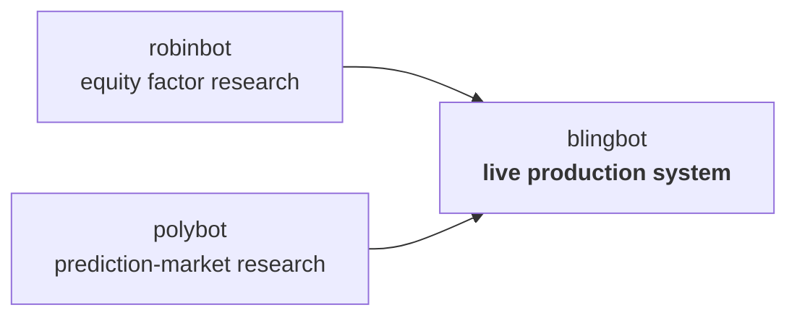

<picture>
  <source media="(prefers-color-scheme: dark)" srcset="assets/banner-dark.svg">
  
</picture>

Hi, I'm Jack. I studied data science at UC Santa Barbara, and since graduating I've built AI agents, data pipelines, and CRM automation for companies in insurance, lending, and healthcare. On my own time I build autonomous systems and run them for real: one trades my money, one plans my training.

## Running live

### blingbot — autonomous trading

An agentic trading system running on Robinhood and Polymarket US. An LLM does continuous research and proposes trades; deterministic code does all of the sizing, risk checks, and order execution. It has traded a real account without a human in the loop since June 2026. Most of the work turned out to be the unglamorous part: loss breakers, broker reconciliation, an append-only audit log, and replaying every strategy change against recorded history before it ships.

The code is private because it trades a live account. Ask me about the architecture, or about the post-mortems — those are the good stories.

### healthybot — training intelligence

I rowed varsity crew at UCSB, and healthybot is the coach I wish I'd had. It pulls Garmin wearable data, DEXA scans, sleep, and training logs into daily readiness and training-load analysis. The numbers come from deterministic engines; an LLM explains them and answers questions, but never invents them.

## Where blingbot came from

Before blingbot went live, I built two research systems to find out what actually works: **robinbot** ran equity factor studies with out-of-sample discipline, and **polybot** tested prediction-market strategies against placebo controls. Most of what they found was that popular edges don't survive honest testing — copy-trading, cross-venue arbitrage, and wallet-skill signals all came out smaller than the trading costs to harvest them. The methods that survived that gauntlet are what blingbot runs today.

## Also building

- **reachy-mini** — desk-robot experiments with a Reachy Mini, including a build that reacts to incoming RingCentral calls through a Cloudflare Workers relay.
- **jarvis** — a 3D solar-system dashboard where each of my projects is a planet with its own daemon reporting into Discord.
- **socialbot** — a core for social automation where every outbound action has to pass deterministic safety gates and an audit log first.
- **collegeessay.fun** — an AI essay-coaching platform: Express workspace, FastAPI agent service, deployed with docker-compose.

## Contact

**jackmdj02@gmail.com** · [linkedin.com/in/jackmdj](https://www.linkedin.com/in/jackmdj)
