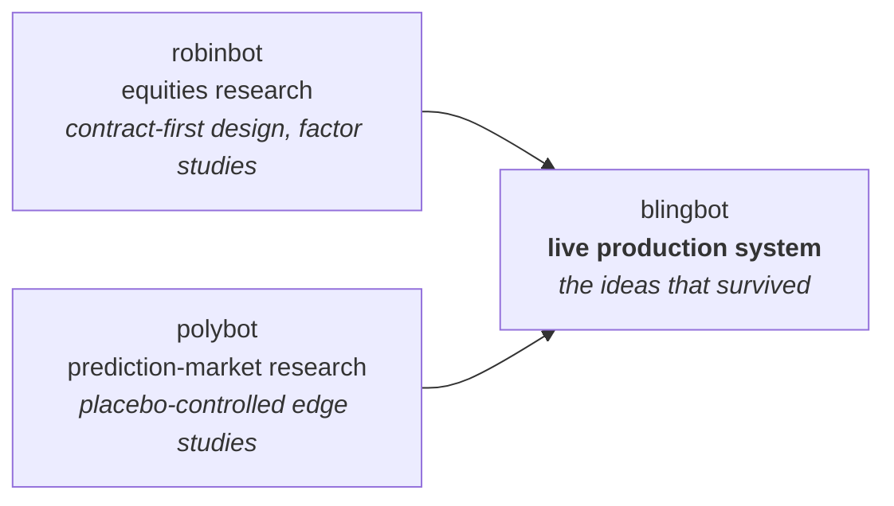

<picture>
  <source media="(prefers-color-scheme: dark)" srcset="assets/banner-dark.svg">
  
</picture>

I build **agentic systems with deterministic rails** — an LLM proposes, fail-closed code disposes — and then I live with the consequences: my trading system runs my money and my health system runs my training. Data science background; production-operations habits.

---

## Two systems, running live

### 🟢 blingbot — autonomous cross-venue trading

Continuous LLM research proposes trades across US equities and CFTC-regulated prediction markets; deterministic, fail-closed rails do all sizing, gating, and execution. Live with real capital since June 2026 — which means the interesting work is operational: loss breakers, broker reconciliation, an append-only audit trail, replay-backed strategy changes (nothing ships on vibes), a self-curating trading universe, and watchdogs that survive the host machine literally powering itself off overnight.

*Source is private because it trades a real account — I'm happy to walk through the architecture, the post-mortems, and the experiments that didn't survive.*

### 🟢 healthybot — athletic intelligence

Turns Garmin wearable data, BodySpec DEXA scans, training logs, and sleep data into daily coaching. Deterministic analysis engines compute readiness, training load, and sleep quality; an LLM orchestrator narrates and answers questions but never invents a number. Same design creed as blingbot, pointed at my body instead of my portfolio.

---

## How blingbot got here

blingbot is the survivor of a deliberate research funnel — two earlier systems whose job was to kill bad ideas cheaply:

Most of what those systems found was **negative results, proven carefully**: copy-trading edges smaller than the spread that must be crossed, cross-venue "arbitrage" that was structural rather than mispriced, apparent skill that dissolved under signless placebo controls. The methodology — out-of-sample discipline, synthetic nulls, replay before deploy — is what actually graduated to production.

---

## Also in the lab

- 🤖 **reachy-mini** — physical robotics experiments with a Reachy Mini desk robot, including a call-reactive build: RingCentral events → Cloudflare Workers relay → robot reactions, outbound-HTTPS-only with no customer data touched.
- 🪐 **jarvis / OLYMPUS-OS** — a 3D-orrery command center where each of my projects is a planet with its own daemon, reporting through a central orchestrator into Discord.
- 🛡️ **socialbot** — a safety-gated core for social automation: every outbound action passes deterministic gates and an append-only audit log before any platform adapter fires.
- 📝 **collegeessay.fun** — an AI essay-coaching platform: Express workspace + FastAPI agent service, shipped as a docker-compose stack behind a Cloudflare tunnel.

## Operating principles

1. **The LLM proposes; deterministic code disposes.** Language models never touch money, health advice, or the outside world without a fail-closed gate in between.
2. **Replay before deploy.** Strategy and behavior changes are backtested against recorded history before they go live.
3. **Measure or kill.** Every feature carries a ledger; anything that can't prove its edge gets paused, shadowed, or deleted — and I write the post-mortem either way.

---

📫 **jackmdj02@gmail.com**
